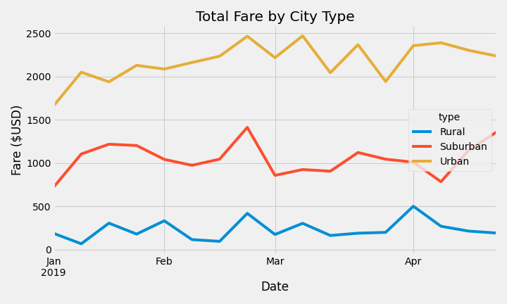

# PyBer_Analysis

## Overview

A ride sharing company has collected data on all rides it provided over the course of the year 2019.  The data include the city in which the ride took place, the type of that city, the number of drivers working in that city, the fare charged, and the date of the ride.  The following analysis has been done to compare the different city types, and to determine if there are any trends upon which the company can act to improve their business.  The analysis is broken into two main portions: a summary of the total fares, total rides, and average fares per ride and driver for each city type for the year as whole; and an examination of the weekly total fares for each city type over the course of several months.

## Results

### Yearly Totals and Averages for each city

The following table shows the differences in totals of rides, drivers, and fares for each city:

From this dataframe we can see that urban cities accounted for the vast majority of rides, as well as the majority of the total fare dollars.  However, urban cities also employed far more drivers than actual rides that took place, meaning the average fare per driver is significantly lower than in the suburban and rural cities.  

Suburban and especially Rural areas had much higher average fares per ride as well.  This is likely due to those areas being more spread out than in tightly packed cities, resulting in longer rides.  
So while urban cities account for the majority of gross dollars for the company, suburban and rural rides were far more profitable.

### Fares by week for each city

In the below chart showing the weekly total fares for each city, it is clear once again that urban areas provide the majority of gross dollars from fares, with rural areas consistently accounting for the lowest fare total.  

However, the fare totals for weeks in January are much lower for urban areas than they are in later months, indiciating a greater demand for rides in urban cities in later months.  For suburban and rural areas, the weekly fares do show some weeks stronger than others, but there is less of a pattern from which to draw any meaningfull conclusions.

## Summary and Recommendations

In summary, while rides in urban areas supply the ride-sharing company the highes gross revenue, the low average fares per ride and per driver make each ride much less profitable than rides in rural and suburban areas.  I would make the following recommendations to the company to enhance the profitability of their business:

- Continue to expand to more urban and suburban areas.
    While each ride provides less revenue in urban areas than in rural areas, continuing to service more urban and suburban areas where demand for rides is higher will continue to result in more gross revenue

- Employ fewer drivers per urban city
    To increase the profitability of the business in urban areas, the company should cut the number of drivers it employs in each city throughout the year.

- Employ fewer urban drivers in January
    Because of the reduced revenue from rides in January in urban areas, the company should employ fewer urban drivers in January, then begin to hire more drivers in later months with higher demand.

- Raise fare rates in urban areas.
    Because the demand for rides in urban areas is so much higher, but the length of each ride is much shorter, the company could charge a higher rate in urban areas to generate more revenue from each ride.
